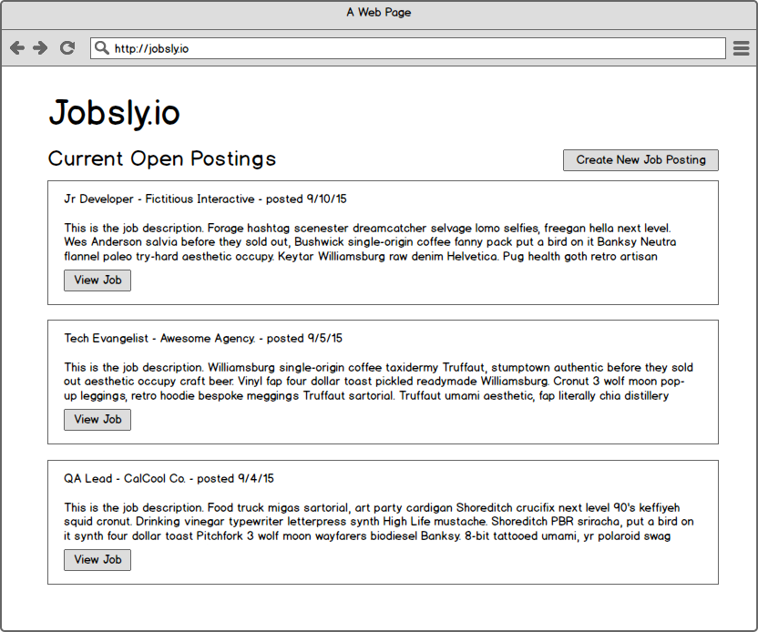
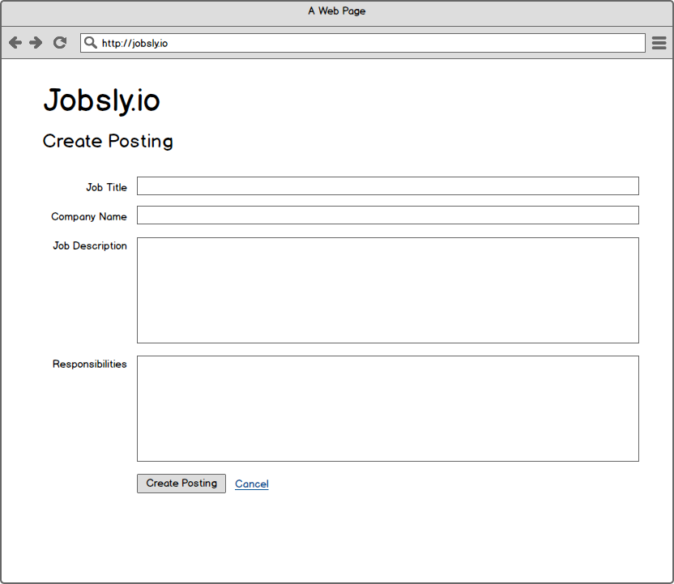
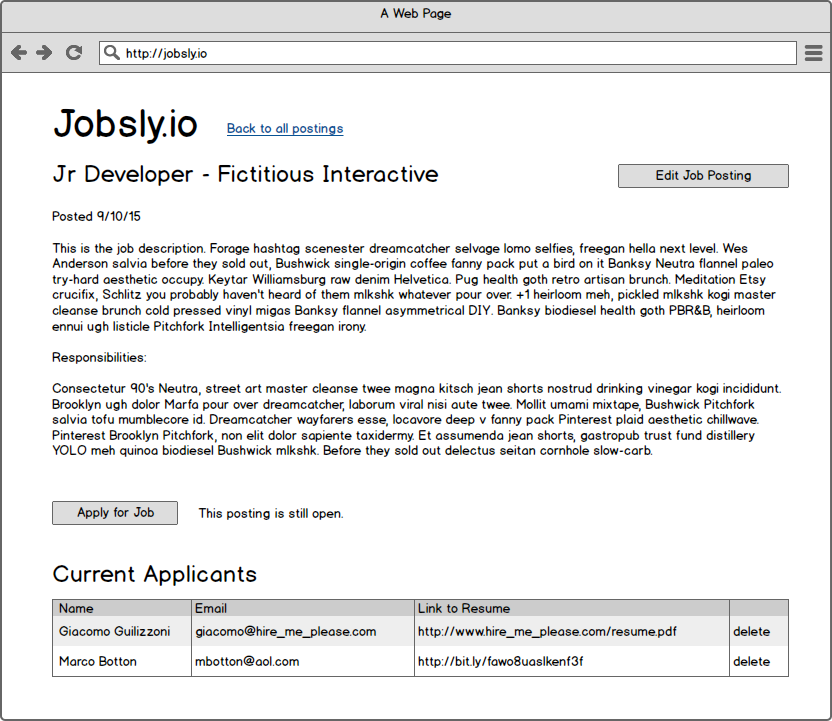
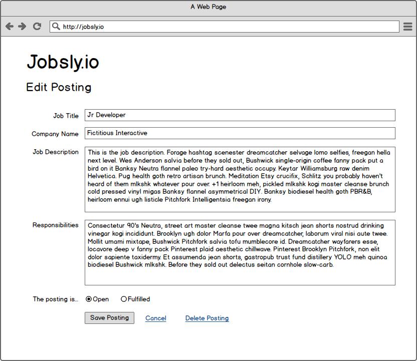
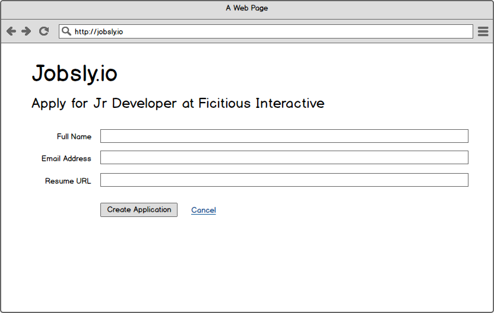

# CRUD Assessment

This is a formative assessment to test your ability to ship code. You have the entire day (until 5pm) to complete this assessment. Feel free to take any breaks needed but do not disrupt other students.

Set the stage to avoid distractions and provide focus. Close all open browser tabs, terminal windows and close any projects that are open in your text editor to start fresh.

And remember, you've had a lot of exposure to these concepts, so if you forget something try to reason through it - throw some log statements in, take a quick break and come back etc... Ideally this reflects what you are like when you are in a normal working state, so if you are nervous, consider taking a nice walk around the block or looking at cat videos before you start :)

## Wait!!!

Before you rush in, scan this whole document. Look at the designs. Read through the stories. Take your time.

## Requirements

### Expectation

You should be able to quickly build web apps in Express demonstrating the memorization, understanding and application of the following concepts:

    RESTful resources (7 controller actions for primary resource; create, read, and delete actions for the associated resource)
    Validations (checking user submissions on input form fields, such as required fields)
    Associations (i.e. adding tasks to a task list)
    Nested resources (i.e. /people/13/addresses/4)
    A base degree of styling (enough to lay things out according to wireframes - exact alignment not necessary)

### Resources

You are able to use any resources necessary, EXCEPT for viewing other student's github repositories. This could include reference docs, past code from projects, etc.

However you cannont copy/paste code directly from resources. This is to slightly increase the cognitive load so that you have to make deliberate choices about what to use because you can't just quickly copy/paste everything to try stuff until it works.

### Process

This will be assessed in a series of 3 summative assessments, each within a given time frame (no more than 1 day in class). During each assessment, you'll need to record a screencast that will be turned in upon completion. You must pass at least one of the three. If you pass one, you do not need to take the remaining assessments. As this is an objective based assessment, each test will not get harder (i.e. add requirements) but will be in a different problem domain.

Code will be judged on correctness and completeness.

Before turning in your application, go back through and review the stories and wireframes. Take time to ensure that everything is complete and the features are all there. Click around in your app to retest everything and compare against the wireframes.

If everything looks complete, then commit, push, and submit a pull request. Raise your hand to get the flash drive to upload your screencast onto.

### Screencast Instructions

Open Quicktime Player. In the menubar, navigate to File > New Screen Recording. In the window that appears, click the red record button then click once to begin recording your entire screen. To end the recording, click on the stop button in the menu bar.

After stopping your recording, save it by going to File > Export > 480p. Your screen recording should be saved with your name and the assessment number. As an example, I would save the first assessment as `logan_king_1.mov`.

## User Stories w/ Wireframes

You are building an open market job application portal. Your client feels that what they need in the system is unique and so doesn't want to use any currently existing solutions.

### Users can see all open postings (newest first)

Each posting shows:
* The job title
* The hiring company
* The short description of the job
* The date posted

Postings should appear with the most recent ones at the top.

If the posting has been fulfilled, it shouldn't show on the home page.

### Users can create a job posting

Job postings have
* A title
* A hiring company
* A short description of the job (which will show up on the main listing page)
* A detailed description of the job's responsibilities
* The date that the posting was created
* A boolean value of whether the posting has been filled or is still open

Job postings are required to include a title, the hiring company, and the short description of the job. The other fields are optional.

Job posting start with the posting as open. As such, the open/fulfilled option is not visible on the New Posting page.

### Users can see a detailed page for a single job posting

The detail page should show all the fields from the job posting. It also should include buttons to edit the posting and apply for the job.

If the posting has been fulfilled, you shouldn't be able to apply for the job.

All the applicants for the job should show on the detail page. They should include links to delete the applicant.

### Users can edit an existing job posting

Job postings are required to include a title, the hiring company, and the short description of the job. The other fields are optional.

The open/fullfiled option should be visibile and editable on the update page so that postings can be marked as fulfilled.

### Users can delete an existing job posting from the edit page

### Users can create an application for a specific posting

Applications have
* Applicant name
* Applicant email
* URL to applicant's resume

### Users can see all applications for a specific posting

### Users can delete a specific application
